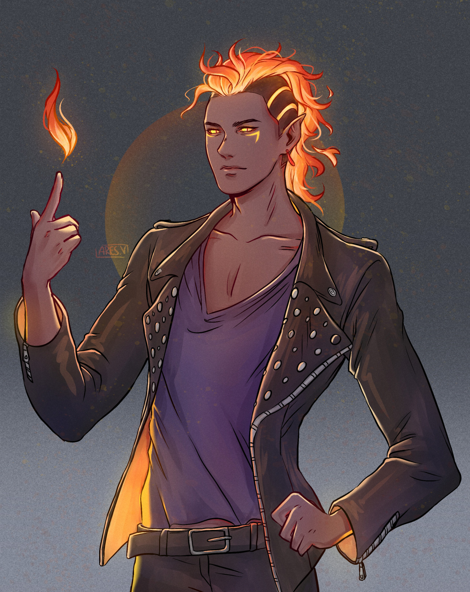

# Dante

## Introduction

- Class Level:
  - Warlock 9
- Background
- Race: Half Tiefling, Half Fire Genasi
- Alignment: Chaotic Evil
- Languages: Common, Infernal, & Primordial

### Fire Genasi

_As a fire genasi, you have inherited the volatile mood and keen mind of the efreet. You tend toward impatience and making snap judgments. Rather than hide your distinctive appearance, you exult in it._

_Nearly all fire genasi are feverishly hot as if burning inside, an impression reinforced by flaming red, coal- black, or ash-gray skin tones. The more human-looking have fiery red hair that writhes under extreme emotion, while more exotic specimens sport actual flames dancing on their heads. Fire genasi voices might sound like crackling flames, and their eyes flare when angered. Some are accompanied by the faint scent of brimstone._

### Tiefling

_To be greeted with stares and whispers, to suffer violence and insult on the street, to see mistrust and fear in every eye: this is the lot of the tiefling. And to twist the knife, tieflings know that this is because a pact struck generations ago infused the essence of Asmodeus, overlord of the Nine Hells (and many of the other powerful devils serving under him) into their bloodline. Their appearance and their nature are not their fault but the result of an ancient sin, for which they and their children and their children's children will always be held accountable._

## Abilities & Skills

$P = 4$

- **Strength:** 8
  - Saving Throws: -1
  - Athletics: -1
- **Dexterity:** 8
  - Saving Throws: -1
  - Acrobatics: -1
  - Sleight of Hand: -1
  - Stealth: -1
- **Constitution:** 16 _(+1 Racial)_
  - Saving Throws: +3
- **Intelligence:** 8
  - Saving Throws: -1
  - Arcana: -1
  - History: -1
  - Investigation: -1
  - Nature: -1
  - Religion: -1 _+P_
- **Wisdom:** 12 _+P_
  - Saving Throws: +1 _+P_
  - Animal Handling: +1
  - Insight: +1 _+P_
  - Medicine: +1
  - Perception: +1 _+Cha (Genie) +P_
    - Darkvision _(Racial)_
      - _Dante can see in dim light within 60 feet of you as if it were bright light, and in darkness as if it were dim light.  His ties to the Elemental Plane of Fire make his darkvision unusual: everything he sees in darkness is in a shade of red._
  - Survival: +1
- **Charisma:** 20
  - Saving Throws: +5 _+P_
  - Deception: +5 _+P_
  - Intimidation: +5 _+P_
  - Performance: +5
  - Persuasion: +5 _+P_

## Combat

- Armor Class (AC): 12
- Spell Save $DC = 8 +P +CHA$
- Initiative: -1
- Speed: 30
- Hit Point Maximum: 88
- Damage Taken:
- Resistances:
  - Fire Resistance

### Attack Options

Physical:

- Crossbow

## Spells

### Cantrips

- Racial: 2
- Class: 3

#### [Thaumaturgy _(Racial)_](http://dnd5e.wikidot.com/spell:thaumaturgy) - _Oh Brother! Where art thou?!_

- **Casting Time:** 1 action
- **Range:** 30 ft
- **Components:** V

#### [On/Off](http://dnd5e.wikidot.com/spell:on-off) -

- **Casting Time:** 1 action
- **Range:** 60 feet
- **Components:** V, S
- **Duration:** Instantaneous

#### [True Strike](http://dnd5e.wikidot.com/spell:true-strike) - _For the power of friendship!_

- **Casting Time:** 1 action
- **Range:** 30 feet
- **Components:** S
- **Duration:** Concentration, up to 1 round

#### [Eldritch Blast](http://dnd5e.wikidot.com/spell:eldritch-blast) - _Join the anguish of exaltation!_

- **Casting Time:** 1 action
- **Range:** 120 ft
- **Components:** V, S
- **Duration:** instantaneous
- **Effect Condition:** Ranged Spell Attack
- **Damage:** 1d10 + CHA _(Eldritch Invocation)_

#### [Create Bonfire](http://dnd5e.wikidot.com/spell:create-bonfire) - _From the Ashes, we Rise..._

- **Casting Time:** 1 action
- **Range:** self
- **Components:** V, S
- **Duration:** 1 hr

#### [Friends](http://dnd5e.wikidot.com/spell:friends)

- **Casting Time:** 1 action
- **Range:** self
- **Components:** S, M
- **Duration:** 1 min

### Level 1

- Racial: 2
- Class: 2

#### [Burning Hands _(Racial)_](http://dnd5e.wikidot.com/spell:burning-hands) - _Become the Flame, and attain life eternal!_

- **Casting Time:** 1 action
- **Range:** Self (15-foot cone)
- **Components:** V, S
- **Duration:** Instantaneous
- **Effect Condition:** DEX Save
- **Damage:** 3d6 fire (+1d6/slot level)

#### [Arms of Hadar (->Efreeti) _(Warlock)_](http://dnd5e.wikidot.com/spell:arms-of-hadar) - _Come, dance with me in hell!_

- **Casting Time:** 1 action
- **Range:** Self (10-ft radius)
- **Components:** V, S
- **Duration:** Instantaneous
- **Effect Condition:** STR Save
- **Damage:** 2d6 fire (+1d6/slot level)

#### [Witch Bolt _(Warlock)_](http://dnd5e.wikidot.com/spell:witch-bolt) - _Embrace the agony._

- **Casting Time:** 1 action
- **Range:** 30 ft
- **Components:** V, S, M
- **Duration:** Concentration, up to 1 minute
- **Effect Condition:** Ranged Spell Attack
- **Damage:** 1d12 fire (+1d12/slot level)

### Level 2

#### [Hellish Rebuke _(Racial)_](http://dnd5e.wikidot.com/spell:hellish-rebuke) - _You dare fight the Flame Eternal!?_

- **Casting Time:** 1 reaction, when damaged by a visible creature within 60 feet
- **Range:** 60 feet
- **Components:** V, S
- **Duration:** Instantaneous
- **Effect Condition:** DEX Save
- **Damage:** 3d10 fire

[Darkness _(Racial)_](http://dnd5e.wikidot.com/spell:darkness)
- **Casting Time:** 1 action
- **Range:** 60 feet
- **Components:** V
- **Duration:** Concentration, up to 10 minutes

[Flame Blade _(Racial)_](http://dnd5e.wikidot.com/spell:flame-blade)
- Casting Time: 1 bonus action 
- Range: Self
- Components: V, S
- Duration: Concentration, up to 10 minutes

#### [Smoky Step _(warlock)_](http://dnd5e.wikidot.com/spell:misty-step)

- **Casting Time:** 1 bonus action
- **Range:** self (30 feet)
- **Components:** V
- **Duration:** Instantaneous

#### [Scorching Ray _(warlock, Genie)_](http://dnd5e.wikidot.com/spell:scorching-ray) - _Glory in the agony of life!_

- **Casting Time:** 1 action
- **Range:** 120 feet
- **Components:** V, S
- **Duration:** Instantaneous
- **Effect Condition:** Ranged Spell Attack
- **Damage:** 2d6/ray (+1 ray/slot level)

#### [Flame Blade _(Racial, Genasi)_](http://dnd5e.wikidot.com/spell:flame-blade)

- **Casting Time:** 1 action
- **Range:** self
- **Components:** V, S, M
- **Duration:** Concentration, $\le 10$ minutes

#### [Darkness _(Racial, Tiefling, Asmodeus)_](http://dnd5e.wikidot.com/spell:darkness)

- **Casting Time:** 1 action
- **Range:** 60 feet
- **Components:** V, M (bat fur and a drop of pitch or piece of coal)
- **Duration:** Concentration, $\le 10$ minutes

### Level 3

### Level 4

#### [Shadow of Moil _(Warlock)_](http://dnd5e.wikidot.com/spell:shadow-of-moil)

#### [Raulothim's Psychic Lance _(Warlock)_](http://dnd5e.wikidot.com/spell:raulothims-psychic-lance)

#### [Galder's Speedy Courier _(Warlock)_](http://dnd5e.wikidot.com/spell:galders-speedy-courier)

### Level 5

#### [Teleportation Circle](http://dnd5e.wikidot.com/spell:teleportation-circle)

#### [Far Step](http://dnd5e.wikidot.com/spell:far-step)

#### [Dream](http://dnd5e.wikidot.com/spell:dream)

## Feats

## Class Feats

- Genie's Luck
  - Add 1d10 to ability check/saving throw
  - 1x/rest (short or long)

### Racial Feats

- [Tiefling - Bloodline of Asmodeus](http://dnd5e.wikidot.com/lineage:tiefling)
  - **Ability Score Increase:** +2 Charisma
  - **Infernal Legacy**
    - [Thaumaturgy](http://dnd5e.wikidot.com/spell:thaumaturgy)
    - [Hellish Rebuke](http://dnd5e.wikidot.com/spell:hellish-rebuke)
    - [Darkness](http://dnd5e.wikidot.com/spell:darkness)
- [Fire Genasi](http://dnd5e.wikidot.com/lineage:genasi-fire)
  - **Ability Score Increase:** +1 Constitution
  - **Reach to the Blaze**
    - [Produce Flame](http://dnd5e.wikidot.com/spell:produce-flame)
    - [Burning Hands](http://dnd5e.wikidot.com/spell:burning-hands)
    - 5th level: [Flame Blade](http://dnd5e.wikidot.com/spell:flame-blade)

## Class Bonuses - [Warlock](http://dnd5e.wikidot.com/warlock) 9

[_see the coffeelock for future inspiration_](https://www.dandwiki.com/wiki/CoffeeLock_(5e_Optimized_Character_Build))

### [Genie (Efreeti)](http://dnd5e.wikidot.com/warlock:the-genie)

_Consider also: [Fiend](http://dnd5e.wikidot.com/warlock:fiend)_

#### Genie's Vessel

Dante has a small, iron ring with a compartment which serves as his spellcasting focus.

- **AC:** Spell Save DC
- **HP:** Warlock Level + Profficiency Bonus

When touching the vessel, he can choose one of two actions:

- **Bottled Respite:** basically a pokeball, but Dante can bring stuff (and other characters) in and hear what is going on outside. Only usable once per long rest.
- **Genie's Wrath:** 1x/turn, `fire_damage += profficiency_bonus`

If destroyed or lost, Dante can perform a 1-hour ceremony to receive a replacement from the Flame Eternal.

### [Eldritch Invocations - 4](http://dnd5e.wikidot.com/warlock:eldritch-invocations)

#### Agonizing Blast

_When you cast eldritch blast, add your Charisma modifier to the damage it deals on a hit._

#### Mask of Many Faces

_You can cast disguise self at will, without expending a spell slot._

#### Kiss of Mephistopheles

_When you hit a creature with your eldritch blast, you can cast fireball as a bonus action using a warlock spell slot. The spell must be centered on the creature you hit with eldritch blast._

#### Voice of the Chain Master

_You can communicate telepathically with your familiar and perceive through your familiar's senses as long as you are on the same plane of existence. Additionally, while perceiving through your familiar's senses, you can also speak through your familiar in your own voice, even if your familiar is normally incapable of speech._

#### Gift of the Ever-Living Ones

_Whenever you regain hit points while your familiar is within 100 feet of you, treat any dice rolled to determine the hit points you regain as having rolled their maximum value for you._

#### Ascendant Step

_You can cast [levitate](http://dnd5e.wikidot.com/spell:levitate) on yourself at will, without expending a spell slot or material components._

### Pact of the Chain

- Dante knows the [find familiar](http://dnd5e.wikidot.com/spell:find-familiar) spell & can cast it as a ritual.
- Any normal form can be chosen, as well as:
  - imp
  - pseudodragon
  - quasit
  - sprite
- Dante can forgo his attack to allow the familiar to make one attack w/ its reaction.
- Dante can communicate telepathically with the familiar and spend an action to share senses with the familiar until the start of next turn.
- Dante can cast touch spells through the familiar.

#### [Sprite of the Flame Eternal](https://www.dndbeyond.com/monsters/17020-sprite)

- **Size:** Tiny
- **AC:** 15
- **HP:** 2
- **Speed:** 10 ft, fly 40 ft
- **Perception:** +3
- **Stealth:** +8
- **Proficiency Bonus:** +2

**Lick of Flames:** _Melee Weapon Attack: +2 to hit, reach 5 ft., one target. Hit: 1 fire damage._

**Shortbow:** _Ranged Weapon Attack: +6 to hit, range 40/160 ft., one target. Hit: 1 piercing damage, and the target must succeed on a DC 10 Constitution saving throw or become poisoned for 1 minute. If its saving throw result is 5 or lower, the poisoned target falls unconscious for the same duration, or until it takes damage or another creature takes an action to shake it awake._

**Heart Sight:** _The sprite touches a creature and magically knows the creature's current emotional state. If the target fails a DC 10 Charisma saving throw, the sprite also knows the creature's alignment. Celestials, fiends, and undead automatically fail the saving throw._

**Invisibility:** _The sprite magically turns invisible until it attacks or casts a spell, or until its concentration ends (as if concentrating on a spell). Any equipment the sprite wears or carries is invisible with it._

## Background - [Acolyte](http://dnd5e.wikidot.com/background:acolyte)

### Shelter of the Faithful

_As an acolyte, you command the respect of those who share your faith, and you can perform the religious ceremonies of your deity. You and your adventuring companions can expect to receive free healing and care at a temple, shrine, or other established presence of your faith, though you must provide any material components needed for spells. Those who share your religion will support you (but only you) at a modest lifestyle._

_You might also have ties to a specific temple dedicated to your chosen deity or pantheon, and you have a residence there. This could be the temple where you used to serve, if you remain on good terms with it, or a temple where you have found a new home. While near your temple, you can call upon the priests for assistance, provided the assistance you ask for is not hazardous and you remain in good standing with your temple._

### Characteristics

**Personality Trait:** *I see omens in every event and action. The gods try to speak to us, we just need to listen.*

**Ideal:** _Aspiration. I seek to prove myself worthy of my god's favor by matching my actions against their teachings. (Chaotic)_

**Bond:** _Everything I do is for the common people._

**Flaw:** *Once I pick a goal, I become obsessed with it to the detriment of everything else in my life.*

### _Other Ideas_

- [Hermit](http://dnd5e.wikidot.com/background:hermit)
- [Haunted One](http://dnd5e.wikidot.com/background:haunted-one)
  - Heart of Darkness [_(Haunted One)_](http://dnd5e.wikidot.com/background:haunted-one) -
  _Those who look into your eyes can see that you have faced unimaginable horror and that you are no stranger to darkness. Though they might fear you, commoners will extend you every courtesy and do their utmost to help you. Unless you have shown yourself to be a danger to them, they will even take up arms to fight alongside you, should you find yourself facing an enemy alone._

## Inventory

- 30 dynamites
- 25 roll-timed bombs
- 10 oil flasks
- A light crossbow and 20 bolts
- An arcane focus
- A dungeoneer's pack
- Leather armor,
- Any simple weapon,
- Two daggers
